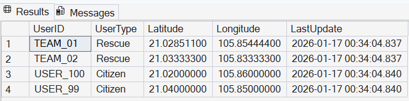
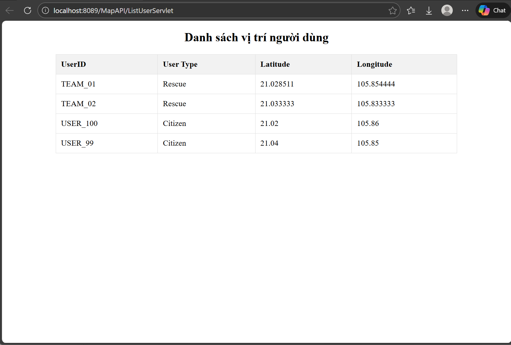

# 📍 Google Maps API Demo – Rescue Location Management

This project is a **Java Servlet–based web application** that displays and manages **real-time locations** of rescue teams and civilians on **Google Maps**.

The project is part of an **Eyeglasses Website system**, where the map feature supports **delivery tracking and emergency rescue services**.

---

## 📸 Screenshots

### Database Structure


### Sample Data



---

## 🛠 Technologies Used
- **Backend:** Java Servlet
- **Frontend:** HTML, CSS, JavaScript
- **Map Service:** Google Maps API
- **Database:** Microsoft SQL Server
- **Server:** Apache Tomcat 9
- **Version Control:** Git & GitHub

---

## 🗄 Database Design

The `UserLocations` table stores user location data:

| Column Name  | Data Type         | Allow Nulls |
|-------------|-------------------|-------------|
| **UserID**      | nvarchar(50)     | No          |
| **UserType**    | nvarchar(20)     | Yes         |
| **Latitude**    | decimal(10,8)    | Yes         |
| **Longitude**   | decimal(11,8)    | Yes         |
| **LastUpdate**  | datetime         | Yes         |

---

## 🔧 Prerequisites / Required Downloads

To run this project locally, please download and install the following software and libraries.

#### 🧑‍💻 Development Tools

* **Apache NetBeans 13 (Windows x64)**
  👉 [Download from Google Drive](https://drive.google.com/drive/folders/1-o-26cV1B0YvS_QCc-L3dLvUD78nGFRn?usp=sharing)
  *(File: `Apache-NetBeans-13-bin-windows-x64.exe`)*

* **JDK 8 (64-bit)**
  👉 [Download from Google Drive](https://drive.google.com/drive/folders/1-o-26cV1B0YvS_QCc-L3dLvUD78nGFRn?usp=sharing)
  *(File: `jdk-8u202-windows-x64.exe`)*

#### 🌐 Application Server

* **Apache Tomcat 9.0.113**
  👉 [Download from Google Drive](https://drive.google.com/drive/folders/1-o-26cV1B0YvS_QCc-L3dLvUD78nGFRn?usp=sharing)
  *(File: `apache-tomcat-9.0.113.exe`)*

#### 📦 Required Libraries (JAR files)

Download the following JAR files and add them to your project’s `WEB-INF/lib` folder:

* **JSTL 1.2**
  👉 [Download from Google Drive](https://drive.google.com/drive/folders/1-o-26cV1B0YvS_QCc-L3dLvUD78nGFRn?usp=sharing)
  *(File: `jstl-1.2.jar`)*

* **SQL Server JDBC Driver**
  👉 [Download from Google Drive](https://drive.google.com/drive/folders/1-o-26cV1B0YvS_QCc-L3dLvUD78nGFRn?usp=sharing)
  *(File: `sqljdbc4.jar`)*


---
## ⚙️ Setup – SQL Server Network Configuration

To allow the web application to connect to SQL Server, you must enable the **TCP/IP** communication protocol.


### Step 1: Enable TCP/IP in SQL Server Configuration Manager

#### 1️⃣ Open SQL Server Configuration Manager
1. Press **Win + R** to open the **Run** dialog.
2. Copy and paste the command that matches your SQL Server version, then press **Enter**.

| SQL Server Version | Run Command |
|-------------------|------------|
| **SQL Server 2025 (17.x)** | `SQLServerManager17.msc` |
| **SQL Server 2022 (16.x)** | `SQLServerManager16.msc` |
| **SQL Server 2019 (15.x)** | `SQLServerManager15.msc` |
| **SQL Server 2017 (14.x)** | `SQLServerManager14.msc` |
| **SQL Server 2016 (13.x)** | `SQLServerManager13.msc` |
| **SQL Server 2014 (12.x)** | `SQLServerManager12.msc` |
| **SQL Server 2012 (11.x)** | `SQLServerManager11.msc` |

---

#### 2️⃣ Enable TCP/IP Protocol
1. In **SQL Server Configuration Manager**, navigate to:  
   **SQL Server Network Configuration** → **Protocols for [YourInstanceName]**  
   *(Default instance name is usually `SQLEXPRESS')*

2. Right-click **TCP/IP**  
3. Select **Enable**

---
#### 3️⃣ Configure TCP Port (1433)
1. Right-click **TCP/IP** → **Properties**
2. Open the **IP Addresses** tab
3. Scroll down to the **IPAll** section
4. Configure the following values:

| Field | Value |
|------|-------|
| **TCP Port** | `1433` |

--- 
#### 4️⃣ Restart SQL Server Service
After enabling TCP/IP:
1. Go to **SQL Server Services**
2. Right-click **SQL Server ([YourInstanceName])**
3. Select **Restart**

---
### Step 2: Configure SQL Server Authentication & Enable `sa` Login

#### 1️⃣ Change Server Authentication Mode
1. Open **SQL Server Management Studio (SSMS)**
2. Connect to your SQL Server instance
3. Right-click on the **server name** → select **Properties**
4. Go to the **Security** tab
5. Under **Server authentication**, select:

   **✅ SQL Server and Windows Authentication mode**

6. Click **OK**

---

#### 2️⃣ Enable and Configure `sa` Account
1. In **Object Explorer**, expand:
   - **Security** → **Logins**
2. Find the login named **`sa`**
3. Right-click **`sa`** → select **Properties**

##### 🔑 Change Password
- Go to the **General** tab
- Enter a **new password**
- Confirm the password

##### 🔓 Enable Login
1. Go to the **Status** tab
2. Set:
   - **Login:** `Enabled`
3. Click **OK**

---

#### 3️⃣ Restart SQL Server
Authentication mode changes **require a restart**.

1. Right-click the **server name**
2. Select **Restart**

---

## 🚀 Installation & Run

### 1. Clone the repository
```bash
git clone https://github.com/TrisDuc/DemoGoogleMap.git
